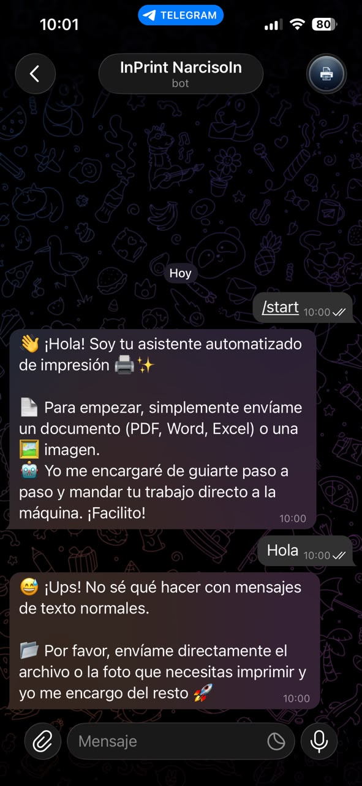
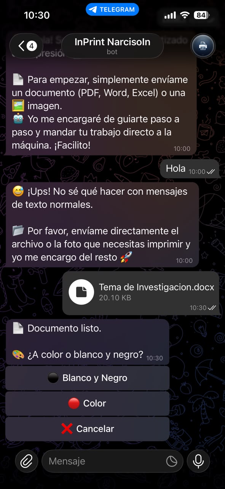
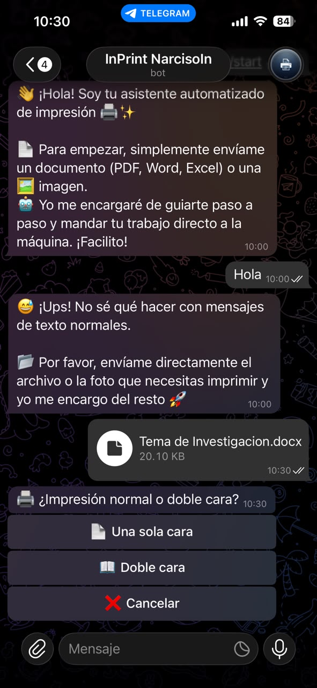
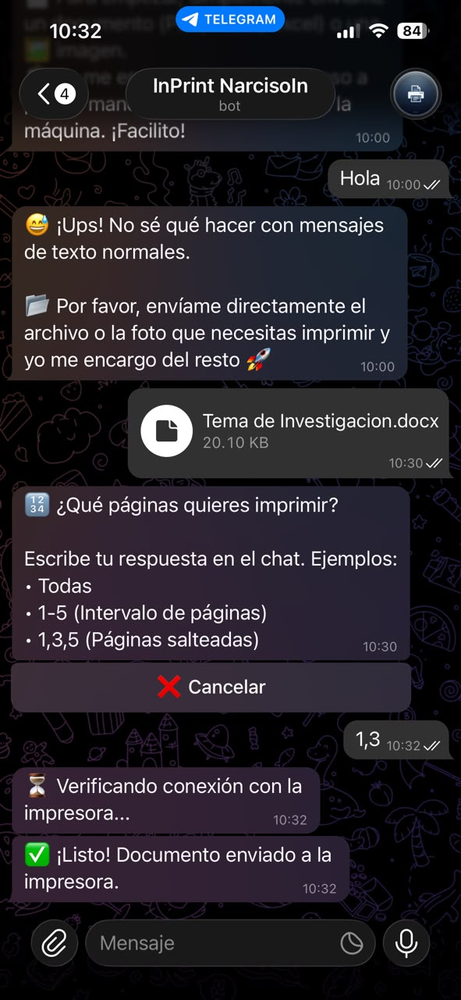
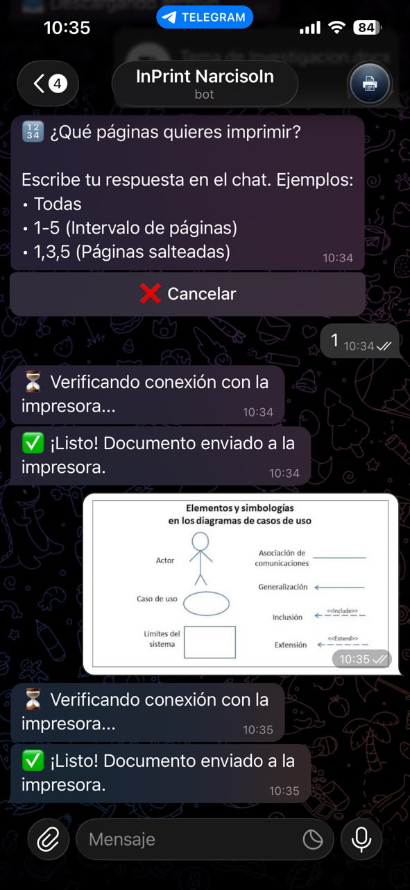
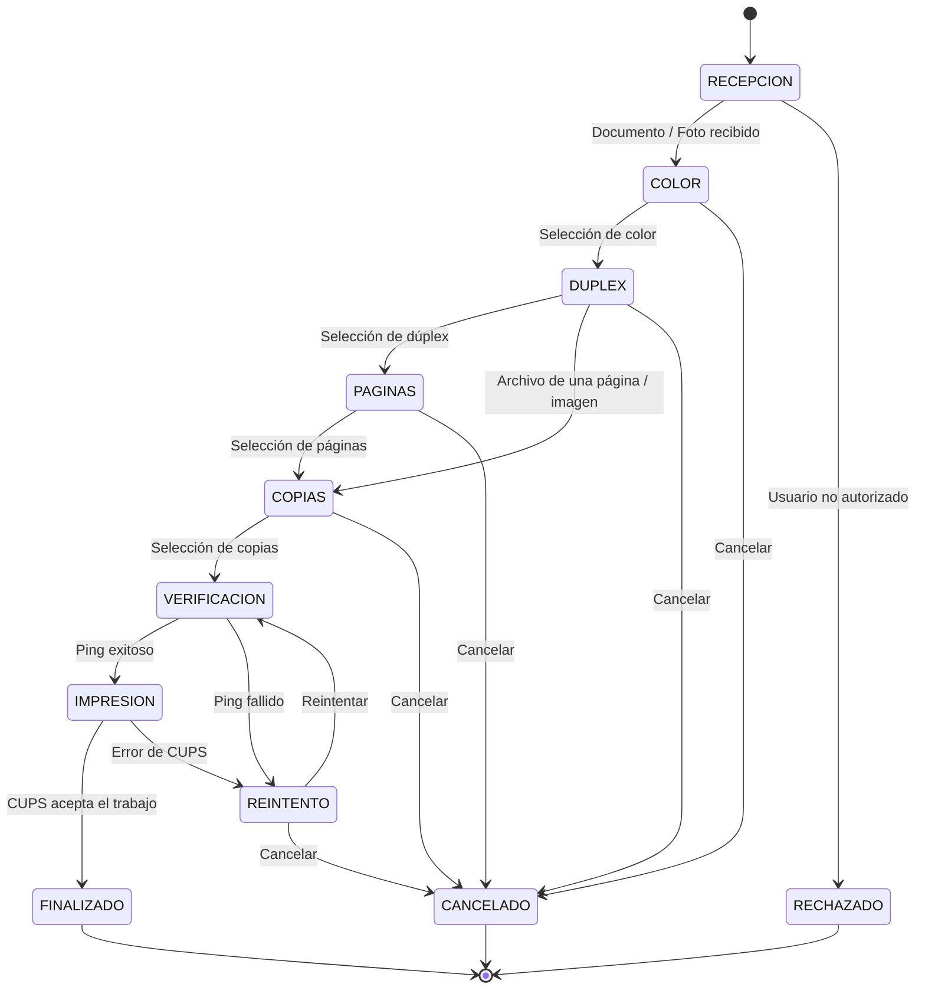

<div allign="center">
  
</div>

# InPrint


>  **Bot de automatización de impresión bajo demanda mediante Telegram, Docker, CUPS y una infraestructura Linux local.**

**InPrint** es un sistema de automatización orientado a estaciones de impresión locales. Permite que un usuario autorizado envíe un documento o una imagen mediante Telegram, seleccione los parámetros de impresión y entregue el trabajo al sistema de impresión del servidor sin requerir acceso directo al equipo que administra la impresora.

El proyecto fue desarrollado y probado originalmente sobre una **Raspberry Pi 5** como servidor local, utilizando una **Brother DCP-T730DW** conectada a la red local mediante una dirección IP estática y administrada desde **CUPS (Common Unix Printing System)**.

La aplicación se ejecuta dentro de un contenedor Docker, mientras que CUPS y la conectividad física/red de la impresora permanecen bajo responsabilidad del host Linux.

---

## Motivación

Aunque existen aplicaciones oficiales de los fabricantes para imprimir desde el celular, suelen requerir configuraciones engorrosas en la red local o la instalación de software adicional que no siempre resulta práctico para todos los miembros de la familia. 

InPrint nació como un proyecto personal para resolver esto de forma más natural: aprovechar una plataforma que todos ya usan en su día a día (Telegram) para ofrecer una interfaz guiada mediante preguntas sencillas. Esto permite imprimir documentos de manera remota y sin fricción, facilitando el proceso para cualquier integrante de la casa sin necesidad de instalar apps especializadas.

---

## Tabla de contenidos

- [Demostración de uso](#-demostración-de-uso)
- [Características](#características)
- [Casos de uso](#casos-de-uso)
- [Arquitectura del sistema](#arquitectura-del-sistema)
- [Máquina de estados](#máquina-de-estados)
- [Flujo de ejecución](#flujo-de-ejecución)
- [Procesamiento de archivos](#procesamiento-de-archivos)
- [Seguridad y control de acceso](#seguridad-y-control-de-acceso)
- [Manejo de errores y observabilidad](#manejo-de-errores-y-observabilidad)
- [Hardware y software de referencia](#hardware-y-software-de-referencia)
- [Prerrequisitos del host](#prerrequisitos-del-host)
- [Configuración de CUPS](#configuración-de-cups)
- [Clonación e instalación](#clonación-e-instalación)
- [Variables de entorno](#variables-de-entorno)
- [Despliegue con Docker Compose](#despliegue-con-docker-compose)
- [Estructura del proyecto](#estructura-del-proyecto)
- [Operación y mantenimiento](#operación-y-mantenimiento)
- [Consideraciones de seguridad](#consideraciones-de-seguridad)
- [Limitaciones conocidas](#limitaciones-conocidas)
- [Mejoras futuras](#mejoras-futuras)
- [Licencia](#licencia)

---

## Demostración de uso

<table>
  <tr>
    <td align="center">
      <br>
      <strong>1. Recepción y validación</strong><br>
      El bot recibe el archivo y valida que el usuario esté autorizado.
    </td>
    <td align="center">
      <br>
      <strong>2. Selección de color</strong><br>
      El usuario selecciona impresión en blanco y negro o a color.
    </td>
    <td align="center">
      <br>
      <strong>3. Selección de dúplex</strong><br>
      Se define si el documento se imprime a una o dos caras.
    </td>
  </tr>
  <tr>
    <td align="center">
      <br>
      <strong>4. Selección de páginas</strong><br>
      El usuario indica todas las páginas o un rango específico.
    </td>
    <td align="center">
      <br>
      <strong>5. Selección de copias</strong><br>
      Se selecciona rápidamente la cantidad de copias a imprimir.
    </td>
    <td align="center">
      <br>
      <strong>6. Envío a impresión</strong><br>
      El bot verifica la impresora y envía el trabajo a CUPS.
    </td>
  </tr>
</table>

---

## Características

- Recepción de **PDF, documentos de Office e imágenes** mediante Telegram.
- Conversión automática de documentos ofimáticos a PDF mediante **LibreOffice en modo headless**.
- Normalización de imágenes mediante **Pillow** y conversión a PDF.
- Detección del número de páginas de PDF mediante **pypdf**.
- Selección interactiva de:
  - modo de color;
  - impresión a una o dos caras;
  - páginas;
  - número de copias.
- Verificación de conectividad de la impresora mediante `ping` antes de enviar el trabajo.
- Integración con **CUPS** mediante `lp`.
- Persistencia de logs mediante `TimedRotatingFileHandler`.
- Limpieza de archivos temporales después de una operación completada o cancelada.
- Lista blanca de usuarios autorizados mediante variables de entorno.
- Alertas administrativas ante intentos de acceso no autorizado, impresora no disponible y errores de CUPS.
- Despliegue reproducible mediante **Docker y Docker Compose**.
- Uso del socket Unix de CUPS del host desde el contenedor.
- Reinicio automático del servicio mediante `restart: unless-stopped`.

---

## Casos de uso

### Homelabs

InPrint puede desplegarse en una Raspberry Pi u otro servidor Linux de bajo consumo para centralizar una impresora de red y exponer una interfaz de impresión sencilla mediante Telegram.

### Pequeños negocios

En un entorno comercial, el bot puede utilizarse como capa de recepción de trabajos para una estación de impresión local, manteniendo el procesamiento aislado del sistema operativo del host.

### Estaciones de impresión locales

El sistema también puede funcionar como middleware entre una aplicación de mensajería y una impresora administrada por CUPS, evitando que los usuarios necesiten interactuar directamente con el servidor.

---

# Arquitectura del sistema

La arquitectura utiliza una separación clara entre **aplicación**, **contenedor**, **servicios del host** e **impresora de red**.

```text

                         INTERNET
                            |
                            v
                    +----------------+
                    |    Telegram    |
                    |     Bot API    |
                    +-------+--------+
                            |
                            v
              +----------------------------+
              |       Raspberry Pi 5       |
              |         Linux Host         |
              |                            |
              |  +----------------------+  |
              |  |     Docker Engine    |  |
              |  |                      |  |
              |  | +------------------+ |  |
              |  | |      InPrint     | |  |
              |  | |------------------| |  |
              |  | | Python 3.11      | |  |
              |  | | python-telegram- | |  |
              |  | | bot              | |  |
              |  | | Pillow / pypdf   | |  |
              |  | | LibreOffice CLI  | |  |
              |  | +---------+--------+ |  |
              |  +-----------|----------+  |
              |              |             |
              |              | lp / socket |
              |              v             |
              |      +----------------+    |
              |      |      CUPS      |    |
              |      |    cups.sock   |    |
              |      +--------+-------+    |
              +---------------|------------+
                              |
                              | TCP/IP
                              v
                   +---------------------+
                   | Brother DCP-T730DW  |
                   |      Static IP      |
                   +---------------------+

```

### Responsabilidades por componente

| Componente | Responsabilidad |
|---|---|
| Telegram | Canal de recepción de documentos e interacción con el usuario |
| `inPrint.py` | Lógica principal del bot y máquina de estados |
| Docker | Aislamiento y empaquetado de la aplicación |
| LibreOffice | Conversión de archivos Office a PDF |
| Pillow | Normalización de imágenes |
| pypdf | Lectura y conteo de páginas PDF |
| `ping` | Validación previa de conectividad de la impresora |
| `lp` | Envío del trabajo de impresión al sistema CUPS |
| CUPS del host | Cola, procesamiento y comunicación con la impresora |
| Raspberry Pi 5 | Servidor local de ejecución |
| Brother DCP-T730DW | Dispositivo físico de impresión |

---

# Máquina de estados

La interacción con el usuario se implementa mediante `ConversationHandler` de `python-telegram-bot`.



## Estados implementados

### `COLOR`

Permite seleccionar:
- `Gray`: impresión en blanco y negro.
- `RGB`: impresión a color.

La selección se almacena en `context.user_data`.

### `DUPLEX`

Permite seleccionar:
- `None`: impresión a una sola cara.
- `DuplexNoTumble`: impresión dúplex por el borde largo.

### `PAGINAS`

Para documentos con más de una página, el usuario cuenta con un **botón de acción rápida** (`📄 Todas las páginas`) para imprimir el documento completo con un solo toque y sin necesidad de usar el teclado.

Si el usuario requiere imprimir páginas específicas, puede escribir directamente en el chat una expresión compatible con el parámetro `-P` de CUPS. Ejemplos:

```text

1-5
1,3,5

```

También se aceptan las entradas textuales `Todas` y `Todo`, que el bot transforma internamente a `all`.

### `COPIAS`

El usuario selecciona rápidamente el número de copias mediante un teclado inline:

```text

1 | 2
3 | 4
5 | 10

```

### `REINTENTO`

Se utiliza cuando:

- la impresora no responde al `ping`; o

- CUPS devuelve un error al intentar crear el trabajo.

El usuario puede reintentar la operación conservando los parámetros seleccionados en `context.user_data` o cancelar el flujo.

---

# Flujo de ejecución

## 1. Recepción

El `ConversationHandler` recibe mensajes que sean documentos o fotografías:

```python

entry_points=[
    MessageHandler(
        filters.Document.ALL | filters.PHOTO,
        recibir_documento
    )
]

```

El identificador de Telegram del usuario se obtiene desde `update.message.from_user.id`.

---

## 2. Control de acceso

Antes de descargar o procesar el archivo, el ID del usuario se compara con la lista definida en:

```env

USUARIOS_PERMITIDOS=123456789,987654321

```

Si el identificador no está presente:

1. Se registra un evento `INTENTO NO AUTORIZADO`.

2. Se genera una alerta al `ADMIN_ID`.

3. La solicitud finaliza sin pasar al flujo de impresión.

>  **Nota de implementación:** *la versión actual del código también envía al usuario no autorizado el mensaje `Acceso denegado.`. Por lo tanto, el comportamiento realmente implementado no es completamente silencioso.*

---

## 3. Descarga

El bot obtiene el archivo desde Telegram y lo almacena temporalmente dentro del directorio de trabajo del contenedor:

```python

file = await context.bot.get_file(file_id)
await file.download_to_drive(ruta_original)

```

Los datos necesarios para continuar la conversación se almacenan en:

```python

context.user_data

```

Entre ellos:

```text

usuario_id
usuario
nombre_archivo
ruta
ruta_original
saltar_paginas
color
duplex
paginas
copias

```

---

## 4. Conversión y normalización

El procesamiento depende de la extensión del archivo.

### Archivos de Office

Extensiones manejadas:

```text

.docx
.doc
.xlsx
.xls
.pptx
.ppt

```

La implementación ejecuta LibreOffice mediante `subprocess.run()`:

```bash

libreoffice \
  --headless \
  --convert-to pdf \
  archivo.docx \
  --outdir ./

```

El PDF generado se convierte en la representación intermedia utilizada por CUPS.

### Imágenes

Extensiones manejadas:

```text

.jpg
.jpeg
.png
.webp

```

Pillow abre la imagen y la normaliza a RGB:

```python

imagen = Image.open(ruta_original)
imagen_rgb = imagen.convert("RGB")
imagen_rgb.save(ruta_pdf)

```

Esto proporciona un PDF intermedio compatible con el flujo de impresión del bot.

### PDF

Los PDF que no requieren conversión pasan directamente al flujo de impresión:

```text

PDF recibido
    |
    +--> pypdf
    |
    +--> Conteo de páginas
    |
    +--> Configuración de impresión

```

---

## 5. Optimización de la interacción

El bot consulta el número de páginas con:

```python

reader = PdfReader(context.user_data['ruta'])
len(reader.pages)

```

Cuando el PDF tiene una sola página, se omite la solicitud de selección de páginas.

Las imágenes también omiten esta etapa porque se convierten a un único PDF generado a partir de la imagen recibida.

El objetivo de esta decisión es reducir interacciones innecesarias en documentos simples.

---

## 6. Verificación de la impresora

Antes de enviar el trabajo, el sistema prueba la dirección definida en:

```env

PRINTER_IP=192.168.1.80

```

mediante:

```bash

ping -c 1 -W 2 192.168.1.80

```

Desde Python:

```python

ping = subprocess.run(
    ["ping", "-c", "1", "-W", "2", PRINTER_IP],
stdout=subprocess.DEVNULL,
stderr=subprocess.DEVNULL
)

```

### Ping fallido

El bot:
1. registra `IMPRESORA APAGADA`;
2. notifica al administrador;
3. informa al usuario que la impresora puede estar apagada o desconectada;
4. entra en `REINTENTO`.

No se intenta insertar el trabajo en CUPS mientras la validación de conectividad falla.

---

## 7. Envío a CUPS

Con conectividad confirmada, el bot construye dinámicamente el comando `lp`.

Ejemplo conceptual:

```bash
lp \
  -d Brother \
  -n 2 \
  -o ColorModel=RGB \
  -o Duplex=DuplexNoTumble \
  -P 1-5 \
  archivo.pdf
```

Desde Python, los argumentos se construyen como una lista y se pasan a `subprocess.run()`:

```python

subprocess.run(comando, check=True)

```

Esta estrategia evita construir un único comando shell y permite pasar argumentos como elementos separados.

---

# Procesamiento de archivos

| Tipo | Conversión | Herramienta | Páginas |
|---|---|---|---|
| PDF | No | pypdf | Se cuentan si aplica |
| DOCX / DOC | PDF | LibreOffice | Se cuentan |
| XLSX / XLS | PDF | LibreOffice | Se cuentan |
| PPTX / PPT | PDF | LibreOffice | Se cuentan |
| JPG / JPEG | PDF | Pillow | Se omite |
| PNG | PDF | Pillow | Se omite |
| WEBP | PDF | Pillow | Se omite |

---

# Seguridad y control de acceso

InPrint utiliza un modelo sencillo de control de acceso basado en **whitelist**.

La lista se carga desde variables de entorno:

```env

USUARIOS_PERMITIDOS=123456789,987654321
ADMIN_ID=123456789

```

El token del bot se mantiene fuera del código fuente:

```env

TELEGRAM_TOKEN=tu_token_de_telegram_aqui

```

### Eventos de seguridad

Un intento de acceso no autorizado genera un registro similar a:

```text

2026-09-15 22:00:00 | WARNING | INTENTO NO AUTORIZADO | ID: 987654321 | Nombre: Usuario

```

Además, el administrador recibe una alerta por Telegram.

---

# Manejo de errores y observabilidad

El bot utiliza `TimedRotatingFileHandler` para evitar que el archivo de logs crezca indefinidamente.

Configuración actual:

```python

TimedRotatingFileHandler(
filename='inprint.log',
when='D',
interval=30,
backupCount=6,
encoding='utf-8'
)

```

Esto conserva hasta seis archivos rotados después de cada intervalo configurado.

## Eventos registrados

El sistema registra, entre otros:

```text

INTENTO NO AUTORIZADO
ERROR CONVERSIÓN OFFICE
ERROR CONVERSIÓN IMAGEN
IMPRESORA APAGADA
IMPRESIÓN
CANCELADO
ERROR CUPS

```

## Niveles utilizados

| Nivel | Uso |
|---|---|
| `INFO` | Operaciones normales, impresiones y cancelaciones |
| `WARNING` | Intentos de acceso no autorizado |
| `ERROR` | Fallos de conversión, conectividad o CUPS |

---

# Hardware y software de referencia

## Hardware principal

| Componente | Referencia |
|---|---|
| Servidor | Raspberry Pi 5 |
| Impresora | Brother DCP-T730DW |
| Conectividad | Red local Ethernet/Wi-Fi según infraestructura del host |
| Arquitectura | ARM64 / ARM compatible según imagen Docker |

El proyecto también puede adaptarse a otro servidor Linux compatible con Docker, siempre que pueda acceder al dispositivo CUPS del host y a la red local de la impresora.

## Software principal

```text

Python                  3.11
python-telegram-bot     20+
LibreOffice             Headless / CLI
Pillow
pypdf
python-dotenv
Docker
Docker Compose
CUPS
iputils-ping

```

---

# Prerrequisitos del host

El host debe disponer, como mínimo, de:
- Linux con Docker Engine.
- Docker Compose Plugin.
- CUPS instalado y operativo.
- Conectividad hacia la impresora.
- Impresora configurada en CUPS.
- Socket Unix de CUPS disponible.
- Dirección IP estable para la impresora.
- Permisos adecuados para que el contenedor pueda utilizar el socket de CUPS.

En una distribución basada en Debian/Ubuntu, una instalación inicial puede realizarse con:

```bash

sudo apt update
sudo apt install -y cups cups-client

```

Comprobar el servicio:

```bash

sudo systemctl status cups

```

Habilitarlo al arranque:

```bash

sudo systemctl enable --now cups

```

Verificar que el socket exista:

```bash

ls -l /var/run/cups/cups.sock

```

>  En algunas distribuciones la ruta real puede ser `/run/cups/cups.sock`. El proyecto debe mapear la ruta efectiva utilizada por el host.*

---

# Configuración de CUPS

## 1. Acceso a la interfaz administrativa

La administración de CUPS suele encontrarse en:

```text

http://localhost:631

```

También puede administrarse desde el host mediante CLI.

---

## 2. Verificar las impresoras disponibles

```bash

lpstat -p -d

```

Para identificar todas las colas:

```bash

lpstat -a

```

---

## 3. Configurar la cola de la Brother

La cola utilizada actualmente por el bot es:

```text

Brother

```

Por tanto, debe existir una impresora con ese nombre en CUPS.

Comprobar:

```bash

lpstat -p Brother -l

```

Probar una impresión directamente desde el host:

```bash

lp -d Brother archivo.pdf

```

Antes de desplegar el bot, conviene comprobar que esta orden funciona correctamente en el host.

---

## 4. Dirección IP de la impresora

Definir en el `.env`:

```env

PRINTER_IP=192.168.1.80

```

Usar la dirección IP real de la Brother DCP-T730DW.

Verificación básica:

```bash

ping -c 1 192.168.1.80

```

La IP estática o una reserva DHCP es recomendable para evitar que el bot pierda la impresora después de un cambio de dirección.

---

# Clonación e instalación

Clonar el repositorio:

```bash

git clone https://github.com/NarcisoIn/InPrint_Bot.git
cd InPrint

```

Crear el archivo de configuración:

```bash

cp .env.example .env

```

Editar:

```bash

nano .env

```

Probar previamente CUPS desde el host:

```bash

lpstat -p Brother -l

```

A continuación, construir y arrancar el servicio:

```bash

docker compose up -d --build

```

Verificar:

```bash

docker compose ps

```

Ver logs:

```bash

docker compose logs -f InPrint

```

---

# Variables de entorno

Ejemplo de `.env.example`:

```dotenv

# Token del bot de Telegram
TELEGRAM_TOKEN=tu_token_de_telegram_aqui

# IDs de usuarios autorizados, separados por coma
USUARIOS_PERMITIDOS=123456789,987654321

# ID del administrador
ADMIN_ID=123456789

# IP de la impresora
PRINTER_IP=192.168.1.80

```

## Descripción

| Variable | Obligatoria | Descripción |
|---|---:|---|
| `TELEGRAM_TOKEN` | Sí | Token entregado por BotFather |
| `USUARIOS_PERMITIDOS` | Sí | Lista de Telegram IDs autorizados |
| `ADMIN_ID` | Sí | Telegram ID que recibirá las alertas administrativas |
| `PRINTER_IP` | No | IP de la impresora; tiene un valor predeterminado en el código |

El código usa:

```python

PRINTER_IP = os.getenv("PRINTER_IP", "192.168.1.80")

```

Por lo tanto, `PRINTER_IP` puede omitirse, aunque se recomienda definirla explícitamente en producción.

---

# Despliegue con Docker Compose

El despliegue actual utiliza `network_mode: host` y el socket de CUPS del host.

Configuración esencial:

```yaml

services:
  inprint:
    build: .
    container_name: InPrint
    restart: unless-stopped
    network_mode: host
    environment:
      - CUPS_SERVER=/var/run/cups/cups.sock
    env_file:
      - .env
    volumes:
      - ./inprint.log:/app/inprint.log
      - /var/run/cups/cups.sock:/var/run/cups/cups.sock

```

## ¿Por qué `network_mode: host`?

El contenedor comparte la pila de red del host. Esto simplifica:

- acceso directo a la red local;
- `ping` a la impresora;
- comunicación con servicios del host;
- operación con el entorno de CUPS utilizado por la infraestructura local.

## ¿Por qué mapear `cups.sock`?

CUPS expone un socket Unix para la comunicación local:

```text

/var/run/cups/cups.sock

```

El volumen permite que el proceso dentro del contenedor utilice el servicio de impresión del host sin ejecutar una instancia independiente de CUPS dentro del contenedor.

La relación queda:

```text

 InPrint
    |
    | lp
    v
/var/run/cups/cups.sock
    |
    v
CUPS del host
    |
    v
Brother DCP-T730DW

```

---

# Dockerfile

El contenedor utiliza:

```dockerfile

FROM python:3.11-slim

```

Las dependencias del sistema incluidas actualmente son:

```dockerfile

RUN apt-get update && apt-get install -y \
    libreoffice-core \
    libreoffice-writer \
    libreoffice-calc \
    iputils-ping \
    cups-client \
    && rm -rf /var/lib/apt/lists/*

```

Después se instala `requirements.txt` y se copia la aplicación:

```dockerfile

WORKDIR /app
COPY requirements.txt .
RUN pip install --no-cache-dir -r requirements.txt
COPY . .
CMD ["python", "inPrint.py"]

```

---

# Gestión del ciclo de vida

Levantar el servicio:

```bash

docker compose up -d

```

Reconstruir la imagen:

```bash

docker compose up -d --build

```

Detener:

```bash

docker compose down

```

Reiniciar:

```bash

docker compose restart InPrint

```

Ver estado:

```bash

docker compose ps

```

Ver logs del contenedor:

```bash

docker compose logs -f InPrint

```

Acceder al contenedor para diagnóstico:

```bash

docker exec -it InPrint /bin/bash

```

Comprobar disponibilidad de CUPS desde el contenedor:

```bash

lpstat -p -d

```

Comprobar conectividad desde el contenedor:

```bash

ping -c 1 192.168.1.80

```

---

# Estructura del proyecto

Una estructura esperada para el repositorio es:

```text

InPrint/
├── inPrint.py
├── Dockerfile
├── docker-compose.yml
├── requirements.txt
├── .env.example
├── .gitignore
└── README.md

```

Durante la ejecución pueden generarse:

```text

inprint.log
*.pdf
archivos temporales recibidos

```

Los archivos temporales de cada trabajo se eliminan al finalizar correctamente o cuando el usuario cancela la operación.

---

# Operación y mantenimiento

## Comprobación rápida del sistema

```bash

docker compose ps
lpstat -p Brother -l
ping -c 1 192.168.1.80

```

## Revisión de logs

```bash

tail -f inprint.log

```

Buscar errores:

```bash

grep "ERROR" inprint.log

```

Buscar impresiones:

```bash

grep "IMPRESIÓN" inprint.log

```

Buscar intentos no autorizados:

```bash

grep "INTENTO NO AUTORIZADO" inprint.log

```

---

# Manejo de errores

## Error de conversión Office

Flujo:

```text

Archivo recibido
      |
      v
LibreOffice
      |
      X
Conversión fallida
      |
      +--> Log ERROR
      |
      +--> Alerta al administrador
      |
      +--> Finalización de conversación

```

## Impresora no disponible

```text

Solicitud de impresión
      |
      v
     PING
      |
      X
  Sin respuesta
      |
      +--> Log ERROR
      |
      +--> Alerta al administrador
      |
      +--> Estado REINTENTO

```

## Error de CUPS

```text

Comando lp
     |
     X
CalledProcessError
     |
     +--> Log ERROR
     |
     +--> Alerta al administrador
     |
     +--> Estado REINTENTO

```

## Cancelación

La función `cancelar_operacion()` elimina las rutas temporales asociadas al trabajo y termina el `ConversationHandler`:

```python

return ConversationHandler.END

```

---

# Consideraciones de seguridad

InPrint fue diseñado para una infraestructura local controlada, pero el despliegue debe considerar los siguientes puntos.

### Credenciales

Nunca almacenar el token de Telegram directamente en `inPrint.py`.

Usar:

```text

.env

```

y excluirlo del control de versiones.

### Whitelist

La autorización depende de Telegram IDs explícitos:

```env

USUARIOS_PERMITIDOS=123456789,987654321

```

No confiar en nombres de usuario o nombres visibles como mecanismo de autorización.

### Socket de CUPS

El acceso al socket:

```text

/var/run/cups/cups.sock

```

concede al contenedor una vía directa hacia el sistema de impresión del host. Debe considerarse un recurso privilegiado y mantenerse restringido al servicio que lo necesita.

### Red en modo host

`network_mode: host` simplifica la integración, pero reduce el aislamiento de red propio de un contenedor Docker convencional.

Debe utilizarse únicamente cuando sus ventajas sean necesarias para el entorno de despliegue.

### Archivos recibidos

Los documentos provienen de usuarios externos al sistema operativo y deben tratarse como datos no confiables.

En una versión orientada a producción conviene añadir:
- límite de tamaño de archivo;
- validación de extensiones y tipo MIME;
- directorio temporal dedicado;
- nombres de archivos saneados;
- eliminación garantizada mediante `try/finally`;
- límites de tiempo para conversiones;
- restricciones adicionales para documentos potencialmente maliciosos.

---

# Limitaciones conocidas

Esta sección refleja detalles importantes de la implementación actual.

## 1. La autorización no es completamente silenciosa

La descripción funcional inicial plantea un rechazo silencioso para el usuario no autorizado. Sin embargo, el código actual ejecuta:

```python

await update.message.reply_text("⛔ Acceso denegado.")

```

Por tanto, la implementación actual sí proporciona una respuesta visible al usuario.

## 2. Validación de páginas limitada

El estado `PAGINAS` almacena el texto proporcionado por el usuario y lo envía directamente al argumento `-P`.

Actualmente no existe una validación sintáctica previa para expresiones como:

```text

1-5
1,3,5

```

Una capa de validación permitiría detectar rangos inválidos antes de llamar a CUPS.

## 3. Manejo de archivos temporales

La eliminación de archivos ocurre explícitamente después de una impresión correcta o durante la cancelación.

Sería más robusto centralizar la limpieza en bloques `finally` para garantizar que un archivo temporal también se elimine ante excepciones no contempladas.

## 4. Conversión de PowerPoint

El `Dockerfile` actual instala explícitamente:

```text

libreoffice-core
libreoffice-writer
libreoffice-calc

```

pero no instala explícitamente `libreoffice-impress`.

Aunque la conversión de determinados formatos de presentación puede depender del conjunto de componentes disponibles, **no debe asumirse que `.ppt` y `.pptx` están plenamente cubiertos por esta imagen sin validación**.

Para garantizar soporte de presentaciones conviene incorporar y probar el componente de Impress correspondiente.

## 5. Nombres de archivos recibidos

El código construye rutas directamente a partir de `file_name`:

```python

ruta_original = f"./{nombre_original}"

```

Para un entorno expuesto a usuarios no confiables se recomienda sanear nombres y generar rutas temporales controladas.

## 6. Validación de configuración

Variables como:

```python

TELEGRAM_TOKEN
USUARIOS_PERMITIDOS
ADMIN_ID

```

se consumen directamente al arrancar la aplicación.

Una versión más robusta debería detectar explícitamente variables ausentes o inválidas y terminar con un mensaje de configuración claro.

---

# Mejoras futuras

La arquitectura actual permite evolucionar InPrint hacia una plataforma de impresión local más completa.

## Validación avanzada de archivos

Incorporar:
- límites máximos de tamaño;
- validación MIME;
- detección de archivos corruptos;
- nombres seguros;
- directorios temporales aislados.

## Estado persistente

Actualmente el estado de una conversación reside en `context.user_data`.

Una evolución del proyecto podría almacenar trabajos en una base de datos para habilitar:

```text

Job ID
Usuario
Fecha
Archivo
Copias
Color
Dúplex
Estado

```

## Cola de trabajos

Integrar una cola propia permitiría manejar varios trabajos concurrentes y ofrecer estados como:

```text

QUEUED
PROCESSING
PRINTING
COMPLETED
FAILED
CANCELLED

```

## Observabilidad

Puede incorporarse:
- métricas de trabajos;
- duración de conversiones;
- tasa de errores;
- estado de la cola;
- health checks;
- exportación de métricas a Prometheus/Grafana.

## Administración

Una futura interfaz administrativa podría permitir:
- administrar usuarios autorizados;
- consultar historial;
- visualizar trabajos;
- modificar la impresora;
- consultar estado de CUPS;
- revisar eventos de seguridad.

---

# Ejemplo de flujo completo

```text

[Usuario]
    |
    | Envía PDF / Office / Imagen
    v
[Telegram]
    |
    v
[Whitelist]
    |
    +---- No autorizado ----> [Alerta Admin] ---> [Fin]
    |
    v
[Descarga]
    |
    v
[Conversión]
    |
    +--> Office ----> LibreOffice ----> PDF
    |
    +--> Imagen ----> Pillow ---------> PDF
    |
    +--> PDF -------> Directo
    |
    v
[Conteo de páginas]
    |
    v
[COLOR]
    |
    v

[DUPLEX]
    |
    +--> Documento simple ----+
    |                         |
    v                         |
[PAGINAS]                     |
    |                         |
    +-------------------------+
              |
              v
           [COPIAS]
              |
              v
            [PING]
              |
       +------+------+
       |             |
     FAIL            OK
       |             |
       v             v
 [REINTENTO]       [lp]
       |             |
       +--> Retry   v
                    [CUPS]
                       |
                       v
             [Brother DCP-T730DW]
                       |
                       v
                  [Log + Aviso]
                       |
                       v
                  [Limpieza]
                       |
                       v
                    [Fin]

```

---

# Diagnóstico rápido

### El bot inicia pero no imprime

Comprobar:

```bash

docker compose ps

```

Después:

```bash

docker exec InPrint lpstat -p -d

```

y:

```bash

ping -c 1 192.168.1.80

```

### `lpstat` no encuentra la impresora

Verificar primero en el host:

```bash

lpstat -p -d

```

Si la cola `Brother` no existe, el problema se encuentra en la configuración de CUPS, no en Telegram.

### El contenedor no puede acceder al socket

Comprobar:

```bash

ls -l /var/run/cups/cups.sock

```

y confirmar que el volumen de `docker-compose.yml` coincide con la ubicación real del socket. *(En el compose mapeamos la carpeta entera `/var/run/cups:/var/run/cups` para que la conexión no se caiga si CUPS se reinicia en el host)*.

### Office no convierte correctamente

Revisar:

```bash

docker exec -it InPrint libreoffice --version

```

y realizar pruebas independientes de conversión:

```bash

docker exec -it InPrint \
    libreoffice \
    --headless \
    --convert-to pdf \
    /app/prueba.docx \
    --outdir /app

```

Para presentaciones, verificar específicamente la disponibilidad del componente necesario de LibreOffice.

---

# Filosofía de diseño

InPrint sigue una arquitectura deliberadamente simple:

```text

Telegram
   |
   v
Aplicación Python
   |
   +--> Procesamiento
   |
   +--> Validación
   |
   +--> Automatización
   |
   v
  CUPS
   |
   v
Impresora

```

El bot no intenta reemplazar CUPS. Su función es actuar como una **capa de automatización y experiencia de usuario** situada por encima de la infraestructura de impresión existente.

Esta separación permite mantener:
- el procesamiento en el contenedor;
- la cola de impresión en el host;
- la impresora como recurso de red;
- las credenciales fuera del código;
- la configuración desacoplada de la aplicación.

---

# Estado del proyecto

**Entorno de referencia probado:**

```text

Server:      Raspberry Pi 5
Printer:     Brother DCP-T730DW
OS:          Linux
Runtime:     Docker
Application: Python 3.11
Printing:    CUPS
Interface:   Telegram Bot API

```

## Notas Técnicas

Este documento refleja la implementación funcional actual y su arquitectura de referencia operando sobre una Raspberry Pi 5. InPrint está diseñado principalmente para entornos locales y redes controladas (**Homelabs**). Las características descritas en la sección de mejoras futuras —como la validación avanzada de archivos y el endurecimiento de seguridad— forman parte del **roadmap** del proyecto y se recomienda su evaluación antes de exponer el servicio a usuarios no confiables.

---

## Autor

**Iván Narciso Guzmán Hernández. (NarcisoIn)**

* **Portafolio:** [narcisoguzman.com](https://narcisoguzman.com)

* **GitHub:** [@NarcisoIn](https://github.com/NarcisoIn)

---

## Licencia

Este proyecto se distribuye bajo la licencia **MIT**. Consulta el archivo [LICENSE](LICENSE) para más detalles.

<br>

<div align="center">

  <strong>InPrint</strong><br>

  <i>Automatización de impresión local mediante Telegram + Docker + CUPS.</i>

</div>