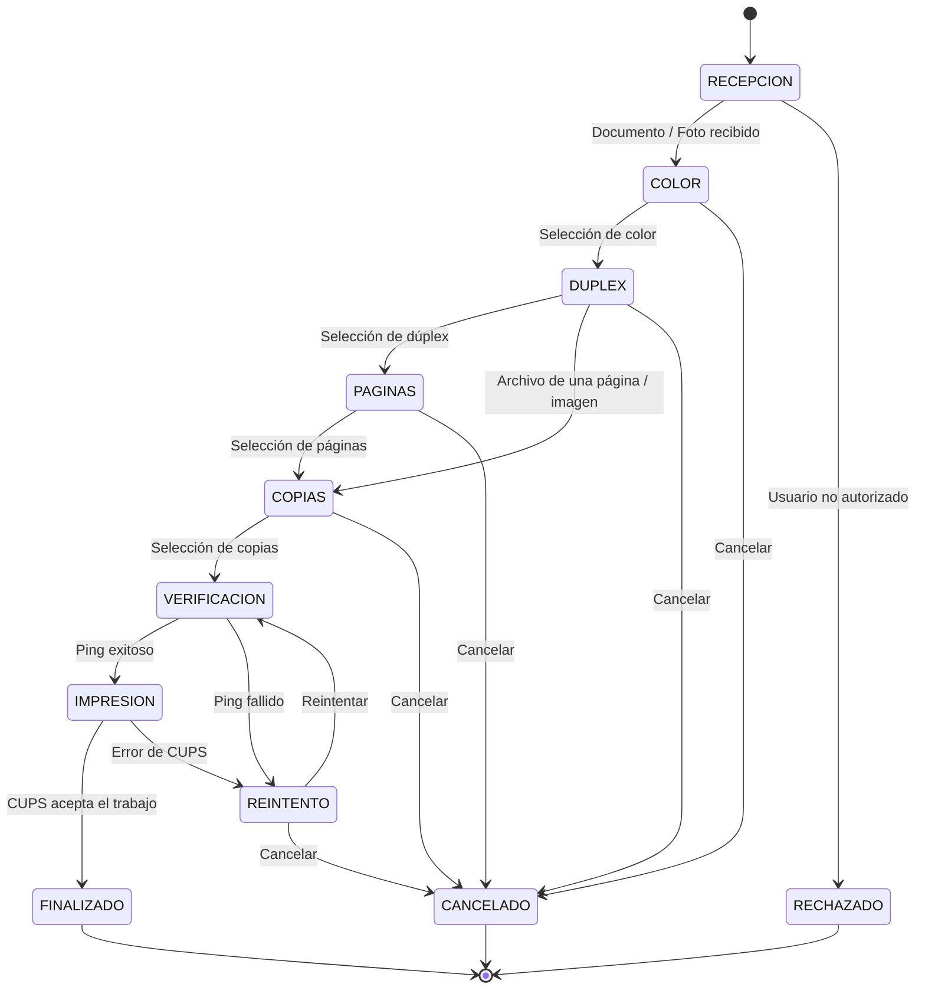

<div align="center">
  
</div>

# InPrint


> **Bot de automatización de impresión bajo demanda mediante Telegram, Docker, CUPS y una infraestructura Linux local.**

**InPrint** es un sistema de automatización orientado a estaciones de impresión locales. Permite que un usuario autorizado envíe un documento o una imagen mediante Telegram, seleccione los parámetros de impresión y entregue el trabajo al sistema de impresión del servidor sin requerir acceso directo al equipo que administra la impresora.

El proyecto fue desarrollado y probado originalmente sobre una **Raspberry Pi 5** como servidor local, utilizando una **Brother DCP-T730DW** conectada a la red local mediante una dirección IP estable y administrada desde **CUPS (Common Unix Printing System)**.

La aplicación se ejecuta dentro de un contenedor Docker, mientras que CUPS y la conectividad física/red de la impresora permanecen bajo responsabilidad del host Linux.

La implementación actual utiliza una arquitectura modular basada en `main.py`, con separación entre configuración y logging (`core/`), interacción con Telegram (`handlers/`) y servicios de procesamiento e impresión (`services/`).

---

## Motivación

Aunque existen aplicaciones oficiales de los fabricantes para imprimir desde el celular, suelen requerir configuraciones adicionales en la red local o la instalación de software específico. InPrint nació como un proyecto personal para resolver esto de forma más natural: aprovechar una plataforma que los usuarios ya utilizan, Telegram, para ofrecer una interfaz guiada mediante preguntas sencillas.

Esto permite imprimir documentos de manera remota y sin necesidad de que el usuario interactúe directamente con el servidor que administra la impresora.

---

## Tabla de contenidos

- [Demostración de uso](#-demostración-de-uso)
- [Características](#características)
- [Casos de uso](#casos-de-uso)
- [Arquitectura del sistema](#arquitectura-del-sistema)
- [Máquina de estados](#máquina-de-estados)
- [Flujo de ejecución](#flujo-de-ejecución)
- [Procesamiento de archivos](#procesamiento-de-archivos)
- [Seguridad y control de acceso](#seguridad-y-control-de-acceso)
- [Manejo de errores y observabilidad](#manejo-de-errores-y-observabilidad)
- [Pruebas automatizadas](#pruebas-automatizadas)
- [Entorno de desarrollo y producción](#entorno-de-desarrollo-y-producción)
- [Hardware y software de referencia](#hardware-y-software-de-referencia)
- [Prerrequisitos del host](#prerrequisitos-del-host)
- [Configuración de CUPS](#configuración-de-cups)
- [Clonación e instalación](#clonación-e-instalación)
- [Variables de entorno](#variables-de-entorno)
- [Despliegue con Docker Compose](#despliegue-con-docker-compose)
- [Dockerfile](#dockerfile)
- [Gestión del ciclo de vida](#gestión-del-ciclo-de-vida)
- [Estructura del proyecto](#estructura-del-proyecto)
- [Operación y mantenimiento](#operación-y-mantenimiento)
- [Manejo de errores](#manejo-de-errores)
- [Consideraciones de seguridad](#consideraciones-de-seguridad)
- [Validación en Raspberry Pi](#validación-en-raspberry-pi)
- [Limitaciones conocidas](#limitaciones-conocidas)
- [Mejoras futuras](#mejoras-futuras)
- [Licencia](#licencia)

---

## Demostración de uso

<table>
  <tr>
    <td align="center">
      <br>
      <strong>1. Recepción y validación</strong><br>
      El bot recibe el archivo y valida que el usuario esté autorizado.
    </td>
    <td align="center">
      <br>
      <strong>2. Selección de color</strong><br>
      El usuario selecciona impresión en blanco y negro o a color.
    </td>
    <td align="center">
      <br>
      <strong>3. Selección de dúplex</strong><br>
      Se define si el documento se imprime a una o dos caras.
    </td>
  </tr>
  <tr>
    <td align="center">
      <br>
      <strong>4. Selección de páginas</strong><br>
      El usuario indica todas las páginas o un rango específico.
    </td>
    <td align="center">
      <br>
      <strong>5. Selección de copias</strong><br>
      Se selecciona rápidamente la cantidad de copias a imprimir.
    </td>
    <td align="center">
      <br>
      <strong>6. Envío a impresión</strong><br>
      El bot verifica la impresora y envía el trabajo a CUPS.
    </td>
  </tr>
</table>

---

## Características

- Recepción de **PDF, documentos de Office e imágenes** mediante Telegram.
- Conversión automática de documentos ofimáticos a PDF mediante **LibreOffice en modo headless**.
- Normalización de imágenes mediante **Pillow** y conversión a PDF.
- Detección del número de páginas de PDF mediante **pypdf**.
- Selección interactiva de:
  - modo de color;
  - impresión a una o dos caras;
  - páginas;
  - número de copias.
- Verificación de conectividad de la impresora mediante `ping` antes de enviar el trabajo.
- Integración con **CUPS** mediante `lp`.
- Lista blanca de usuarios autorizados mediante variables de entorno.
- Aislamiento de cada trabajo mediante un directorio temporal independiente generado con `tempfile.mkdtemp(prefix="inprint-job-")`.
- Saneamiento del nombre de archivo mediante `os.path.basename()` y uso de un nombre por defecto cuando el nombre recibido es vacío o está formado únicamente por puntos.
- Limpieza del directorio temporal después de una impresión completada o cuando el usuario cancela la operación.
- Persistencia de logs mediante `TimedRotatingFileHandler`.
- Alertas administrativas ante intentos de acceso no autorizado, impresora no disponible y errores de CUPS.
- Despliegue reproducible mediante **Docker y Docker Compose**.
- Uso del socket Unix de CUPS del host desde el contenedor.
- Reinicio automático del servicio mediante `restart: unless-stopped`.
- Suite de pruebas automatizadas con `pytest` para lógica de conversión, seguridad de nombres, estados del flujo y comandos de impresión.

---

## Casos de uso

### Homelabs

InPrint puede desplegarse en una Raspberry Pi u otro servidor Linux de bajo consumo para centralizar una impresora de red y exponer una interfaz de impresión sencilla mediante Telegram.

### Pequeños negocios

En un entorno comercial, el bot puede utilizarse como capa de recepción de trabajos para una estación de impresión local, manteniendo el procesamiento de la aplicación separado del sistema CUPS del host.

### Estaciones de impresión locales

El sistema puede funcionar como middleware entre una aplicación de mensajería y una impresora administrada por CUPS, evitando que los usuarios necesiten interactuar directamente con el servidor.

---

# Arquitectura del sistema

La arquitectura utiliza una separación clara entre **interfaz externa**, **aplicación modular**, **contenedor**, **servicio de impresión del host** e **impresora de red**.

```text
                                INTERNET
                                    |
                                    v
                            +----------------+
                            |    Telegram    |
                            |    Bot API     |
                            +-------+--------+
                                    |
                                    v
               +---------------------------------------+
               |             Raspberry Pi 5            |
               |               Linux Host              |
               |                                       |
               |  +---------------------------------+  |
               |  |        Docker Engine            |  |
               |  |                                 |  |
               |  |  +---------------------------+  |  |
               |  |  |          InPrint          |  |  |
               |  |  |---------------------------|  |  |
               |  |  | Python 3.11               |  |  |
               |  |  | python-telegram-bot       |  |  |
               |  |  | core/                     |  |  |
               |  |  | handlers/                 |  |  |
               |  |  | services/                 |  |  |
               |  |  | Pillow / pypdf            |  |  |
               |  |  | LibreOffice CLI           |  |  |
               |  |  | CUPS client / lp          |  |  |
               |  |  +-------------+-------------+  |  |
               |  +----------------|----------------+  |
               |                   |                   |
               |                   | lp / CUPS socket  |
               |                   v                   |
               |          +------------------+         |
               |          |       CUPS       |         |
               |          |    cups.sock     |         |
               |          +---------+--------+         |
               +---------------------|-----------------+
                                     |
                                     | TCP/IP
                                     v
                          +---------------------+
                          | Brother DCP-T730DW  |
                          |      Static IP      |
                          +---------------------+
``` 

### Arquitectura modular de la aplicación

La ejecución actual parte de `main.py`, que inicializa el logger, construye la aplicación de Telegram y registra los handlers.

```text
main.py
│
├── core/
│   ├── config.py
│   └── logger.py
│
├── handlers/
│   └── bot_handlers.py
│
└── services/
    ├── converter.py
    └── printer.py
```

### Responsabilidades por componente

| Componente | Responsabilidad |
|---|---|
| `main.py` | Entry point principal; inicializa logging, crea la aplicación de Telegram y registra los handlers. |
| `core/config.py` | Carga las variables de entorno y expone la configuración utilizada por la aplicación. |
| `core/logger.py` | Configura el sistema de logging mediante `TimedRotatingFileHandler`. |
| `handlers/bot_handlers.py` | Gestiona la interacción con Telegram, el `ConversationHandler`, los estados del flujo, autorización y limpieza del trabajo. |
| `services/converter.py` | Crea el directorio temporal del trabajo, guarda el archivo, convierte Office o imágenes a PDF y determina si debe omitirse la selección de páginas. |
| `services/printer.py` | Comprueba la conectividad de la impresora y construye/envía el trabajo a CUPS mediante `lp`. |
| Docker | Empaquetado y ejecución aislada de la aplicación, manteniendo la integración necesaria con CUPS del host. |
| LibreOffice | Conversión de documentos Office a PDF. |
| Pillow | Conversión y normalización de imágenes a PDF. |
| pypdf | Lectura y conteo de páginas de PDF cuando corresponde. |
| `ping` | Validación previa de conectividad de la impresora. |
| `lp` | Envío del trabajo de impresión a CUPS. |
| CUPS del host | Cola, procesamiento y comunicación con la impresora. |
| Raspberry Pi 5 | Servidor local de ejecución. |
| Brother DCP-T730DW | Dispositivo físico de impresión. |

### Archivos legacy

Los archivos:

```text
inPrint.py
bot_impresion.py
```

corresponden a versiones heredadas del proyecto. Actualmente **no forman parte del flujo de ejecución modular ni del entry point de producción**.

El proceso actual parte de:

```text
main.py
```

Además, la imagen de producción utiliza copias explícitas de los módulos actuales y no depende de esos archivos legacy.

---

# Máquina de estados

La interacción con el usuario se implementa mediante `ConversationHandler` de `python-telegram-bot`.



## Estados implementados

### `COLOR`

Permite seleccionar:

- `Gray`: impresión en blanco y negro.
- `RGB`: impresión a color.

La selección se almacena en `context.user_data`.

### `DUPLEX`

Permite seleccionar:

- `None`: impresión a una sola cara.
- `DuplexNoTumble`: impresión dúplex por el borde largo.

Estos valores se trasladan posteriormente a las opciones de `lp`.

### `PAGINAS`

Para documentos en los que corresponde solicitar páginas, el usuario puede seleccionar todas las páginas mediante el botón `all` o escribir directamente una expresión que posteriormente se pasa al parámetro `-P` de CUPS.

Ejemplos utilizados por el flujo:

```text
1-5
1,3,5
```

También se aceptan las entradas textuales `Todas` y `Todo`, que el bot transforma internamente a `all`.

Para imágenes y PDF de una sola página se omite esta etapa mediante la bandera `saltar_paginas`.

### `COPIAS`

El usuario selecciona rápidamente el número de copias mediante un teclado inline:

```text
1 | 2
3 | 4
5 | 10
```

### `REINTENTO`

Se utiliza cuando:

- la impresora no responde al `ping`; o
- CUPS devuelve un error al intentar crear el trabajo.

El usuario puede reintentar la operación conservando los parámetros seleccionados en `context.user_data` o cancelar el flujo.

---

# Flujo de ejecución

## 1. Recepción

El `ConversationHandler` recibe mensajes que sean documentos o fotografías:

```python
entry_points=[
    MessageHandler(
        filters.Document.ALL | filters.PHOTO,
        recibir_documento
    )
]
```

El identificador de Telegram del usuario se obtiene desde `update.message.from_user.id`.

---

## 2. Control de acceso

Antes de descargar o procesar el archivo, el ID del usuario se compara con la lista definida en:

```env
USUARIOS_PERMITIDOS=123456789,987654321
```

Si el identificador no está presente:

1. Se registra un evento `INTENTO NO AUTORIZADO`.
2. Se genera una alerta al `ADMIN_ID`.
3. Se envía al usuario el mensaje `⛔ Acceso denegado.`.
4. La conversación finaliza sin pasar al flujo de impresión.

El control de acceso se basa en **Telegram IDs explícitos**, no en nombres visibles o usernames.

---

## 3. Creación del trabajo temporal y descarga

Una vez autorizado el usuario, el archivo se descarga desde Telegram y se procesa mediante `services.converter.preparar_archivo()`.

La función crea un directorio temporal independiente mediante:

```python
dir_temp = tempfile.mkdtemp(prefix="inprint-job-")
```

En un sistema Linux el resultado tiene una forma equivalente a:

```text
/tmp/inprint-job-<sufijo>/
```

El uso de un directorio diferente por trabajo evita que dos operaciones compartan accidentalmente el mismo espacio temporal.

Dentro de ese directorio se genera la ruta del archivo recibido y posteriormente, cuando corresponde, el PDF intermedio.

La conversación conserva en `context.user_data` los datos necesarios para las siguientes etapas, entre ellos:

```text
usuario_id
usuario
nombre_archivo
dir_temp
ruta
saltar_paginas
color
duplex
paginas
copias
```

---

## 4. Validación y saneamiento del nombre de archivo

Antes de construir la ruta de trabajo, `services.converter` normaliza el nombre recibido con:

```python
nombre_seguro = os.path.basename(nombre_original or "").strip()
```

Además, cuando el resultado es vacío o está formado únicamente por puntos, se sustituye por:

```text
archivo_sin_nombre
```

La ruta final se construye dentro del directorio temporal:

```python
ruta_original = os.path.join(dir_temp, nombre_seguro)
```

Este mecanismo evita que componentes de ruta como `../` formen parte de la ruta final del archivo en el entorno Linux donde se ejecuta la aplicación.

Este control está orientado al **nombre y la ruta**. No equivale a una validación completa del contenido del archivo, su tamaño, MIME o potencial malicioso.

---

## 5. Conversión y normalización

El procesamiento depende de la extensión del archivo.

### Archivos de Office

Extensiones manejadas:

```text
.docx
.doc
.xlsx
.xls
.pptx
.ppt
```

La implementación ejecuta LibreOffice mediante `subprocess.run()` en modo headless:

```bash
libreoffice \
  --headless \
  --convert-to pdf \
  archivo.docx \
  --outdir /tmp/inprint-job-<sufijo>/
```

El PDF generado se mantiene dentro del mismo directorio temporal del trabajo y es la representación utilizada posteriormente por CUPS.

### Imágenes

Extensiones manejadas:

```text
.jpg
.jpeg
.png
.webp
```

Pillow abre la imagen y la convierte a RGB antes de generar el PDF:

```python
imagen = Image.open(ruta_original)
imagen_rgb = imagen.convert("RGB")
imagen_rgb.save(ruta_pdf)
```

La bandera `saltar_paginas` se establece en `True` para imágenes porque el resultado es un único PDF generado a partir de la imagen recibida.

### PDF

Los PDF recibidos pasan directamente al flujo de impresión. Cuando corresponde, `pypdf` permite conocer el número de páginas antes de solicitar al usuario un rango.

---

## 6. Optimización de la interacción

Para PDF, el sistema intenta determinar el número de páginas mediante:

```python
reader = PdfReader(ruta_pdf)
len(reader.pages)
```

Cuando el PDF tiene una sola página, `saltar_paginas` se establece en `True` y la conversación pasa directamente de `DUPLEX` a `COPIAS`.

Las imágenes también saltan el estado `PAGINAS`.

Con esto se reducen interacciones innecesarias en documentos simples, sin cambiar el mecanismo de impresión.

---

## 7. Verificación de la impresora

Antes de enviar el trabajo, el sistema prueba la dirección definida en:

```env
PRINTER_IP=192.168.1.80
```

mediante el comando:

```bash
ping -c 1 -W 2 192.168.1.80
```

Desde Python:

```python
ping = subprocess.run(
    ["ping", "-c", "1", "-W", "2", PRINTER_IP],
    stdout=subprocess.DEVNULL,
    stderr=subprocess.DEVNULL,
)
```

El código utiliza el código de retorno del proceso para determinar si la impresora responde.

### Ping fallido

El bot:

1. registra `IMPRESORA APAGADA`;
2. notifica al administrador;
3. informa al usuario que la impresora puede estar apagada o desconectada;
4. entra en `REINTENTO`.

No se ejecuta `lp` mientras la comprobación de conectividad falla.

El parámetro `-W 2` representa el tiempo de espera configurado para la respuesta del `ping`. No existe un timeout genérico de `subprocess.run()` para esta operación más allá del comportamiento propio del comando `ping`.

---

## 8. Envío a CUPS

Con conectividad confirmada, el bot construye dinámicamente el comando `lp`.

Ejemplo conceptual:

```bash
lp \
  -d Brother \
  -n 2 \
  -o ColorModel=RGB \
  -o Duplex=DuplexNoTumble \
  -P 1-5 \
  archivo.pdf
```

Desde Python, los argumentos se construyen como una lista y se pasan a `subprocess.run()`:

```python
subprocess.run(comando, check=True)
```

La llamada no utiliza un comando shell único. Cada argumento se entrega como un elemento independiente de la lista.

Si `lp` termina con error, `check=True` hace que se propague un `subprocess.CalledProcessError`, que es capturado por `bot_handlers.py` para registrar el fallo, notificar al administrador y permitir un reintento.

---

## 9. Limpieza del trabajo

Cuando el trabajo se imprime correctamente, `ejecutar_impresion()` elimina el directorio temporal asociado:

```python
if dir_temp and os.path.exists(dir_temp):
    shutil.rmtree(dir_temp)
```

Cuando el usuario cancela la operación, `cancelar_operacion()` realiza la misma limpieza y termina la conversación con:

```python
return ConversationHandler.END
```

La limpieza también permite eliminar el trabajo anterior después de un reintento exitoso.

La implementación actual no centraliza todas las rutas de limpieza en un bloque `finally`; por ello, una excepción durante ciertas etapas de conversión puede dejar un directorio temporal pendiente de eliminación.

---

# Procesamiento de archivos

| Tipo | Conversión | Herramienta | Páginas |
|---|---|---|---|
| PDF | No | pypdf | Se cuentan cuando corresponde |
| DOCX / DOC | PDF | LibreOffice | Se cuentan cuando el PDF resultante puede analizarse |
| XLSX / XLS | PDF | LibreOffice | Se cuentan cuando el PDF resultante puede analizarse |
| PPTX / PPT | PDF | LibreOffice | Se procesan mediante LibreOffice; el soporte de la imagen final depende de los componentes instalados |
| JPG / JPEG | PDF | Pillow | Se omite la selección de páginas |
| PNG | PDF | Pillow | Se omite la selección de páginas |
| WEBP | PDF | Pillow | Se omite la selección de páginas |

---

# Seguridad y control de acceso

InPrint utiliza un modelo sencillo de control de acceso basado en **whitelist**.

La lista se carga desde variables de entorno:

```env
USUARIOS_PERMITIDOS=123456789,987654321
ADMIN_ID=123456789
```

El token del bot se mantiene fuera del código fuente:

```env
TELEGRAM_TOKEN=tu_token_de_telegram_aqui
```

### Controles implementados

| Control | Implementación | Objetivo |
|---|---|---|
| Autorización | Lista de Telegram IDs en `USUARIOS_PERMITIDOS` | Evitar que cualquier usuario pueda iniciar un trabajo de impresión. |
| Alertas | Notificación al `ADMIN_ID` ante eventos definidos | Informar de intentos no autorizados y fallos operativos. |
| Aislamiento temporal | `tempfile.mkdtemp(prefix="inprint-job-")` | Reducir colisiones y accesos accidentales entre trabajos. |
| Saneamiento de nombres | `os.path.basename()` + nombre por defecto | Evitar que componentes de ruta controlados por el nombre recibido modifiquen la ubicación del trabajo. |
| Ejecución de procesos | Listas de argumentos + `check=True` | Evitar depender de un shell para construir los comandos de LibreOffice, `ping` y `lp`, y detectar fallos de proceso. |
| Credenciales | `.env` suministrado mediante Compose | Evitar almacenar tokens y IDs directamente en el código o YAML de producción. |
| Aislamiento de build | `Dockerfile` con copias explícitas + `.dockerignore` | Reducir el contenido innecesario dentro del contexto e imagen de producción. |

### Eventos de seguridad

Un intento de acceso no autorizado genera un registro similar a:

```text
2026-09-15 22:00:00 | WARNING | INTENTO NO AUTORIZADO | ID: 987654321 | Nombre: Usuario
```

Además, el administrador recibe una alerta por Telegram.

---

# Manejo de errores y observabilidad

El bot utiliza `TimedRotatingFileHandler` para controlar el crecimiento del archivo de logs.

Configuración actual:

```python
TimedRotatingFileHandler(
    filename="inprint.log",
    when="D",
    interval=30,
    backupCount=6,
    encoding="utf-8",
)
```

La rotación está configurada en intervalos de 30 días y conserva hasta seis archivos de respaldo.

El logger utiliza `logging.INFO` como nivel base y eleva a `WARNING` los eventos de acceso no autorizado y a `ERROR` los fallos operativos registrados por los handlers.

## Eventos registrados

El sistema registra, entre otros:

```text
INTENTO NO AUTORIZADO
IMPRESORA APAGADA
IMPRESIÓN
CANCELADO
ERROR PROCESAMIENTO
ERROR CUPS
```

El mensaje exacto depende del punto del flujo en el que se produzca el evento.

## Niveles utilizados

| Nivel | Uso |
|---|---|
| `INFO` | Operaciones normales, impresiones y cancelaciones. |
| `WARNING` | Intentos de acceso no autorizado. |
| `ERROR` | Fallos durante procesamiento o envío a CUPS. |

## Timeouts y manejo de procesos

La implementación actual tiene los siguientes comportamientos:

| Proceso | Control actual | Comportamiento ante fallo |
|---|---|---|
| `ping` | `-W 2` | El comando devuelve un código distinto de cero y el bot pasa a `REINTENTO`. |
| LibreOffice | No existe `timeout=` en `subprocess.run()` | `check=True` propaga el error del proceso; el handler informa al administrador y termina esa solicitud con un mensaje de error. |
| `lp` / CUPS | No existe `timeout=` en `subprocess.run()` | `check=True` produce `CalledProcessError`; el handler registra el fallo y ofrece reintento. |

No se implementa actualmente una rutina propia para terminar procesos externos después de un tiempo máximo.

---

# Pruebas automatizadas

El proyecto cuenta con una suite automatizada mediante `pytest` para validar la lógica principal sin depender, en la mayoría de los casos, de Telegram o de una impresora física.

## Estructura de pruebas

```text
tests/
├── conftest.py
├── test_converter.py
├── test_converter_extra.py
├── test_converter_security.py
├── test_handlers_logic.py
└── test_printer.py
```

### `conftest.py`

Define variables de entorno mínimas para que `core.config` pueda importarse sin depender del `.env` real ni de credenciales de producción.

Los valores utilizados por las pruebas son deliberadamente ficticios, por ejemplo:

```text
TELEGRAM_TOKEN=test-token
USUARIOS_PERMITIDOS=1,2,3
ADMIN_ID=1
PRINTER_IP=192.0.2.80
```

### `test_converter.py`

Cubre el flujo básico de `preparar_archivo()` con un archivo simulado y comprueba que se genere y conserve un directorio temporal y una ruta de salida válida.

### `test_converter_extra.py`

Cubre casos adicionales del conversor:

- PDF con extensión en mayúsculas;
- PDF de una sola página y activación de `saltar_paginas`;
- conversión de imágenes a PDF y activación de `saltar_paginas`;
- invocación de LibreOffice con la ruta temporal del trabajo;
- archivos con extensión no soportada, que permanecen sin conversión.

### `test_converter_security.py`

Cubre regresiones de seguridad relacionadas con nombres de archivo:

- intento de `path traversal` mediante `../`;
- nombre vacío;
- nombre formado únicamente por puntos.

En el código actual estas comprobaciones validan el saneamiento implementado en `services.converter`.

### `test_handlers_logic.py`

Valida la lógica del `ConversationHandler` sin levantar Telegram real. Incluye, entre otros casos:

- conversión de `Todas` a `all`;
- conservación de intervalos como `1-5`;
- transición de `COLOR` a `DUPLEX`;
- salto del estado de páginas para imágenes/documentos simples;
- transición normal hacia `PAGINAS`;
- limpieza del directorio al cancelar;
- envío lógico a CUPS y limpieza posterior de un trabajo exitoso mediante mocks.

### `test_printer.py`

Valida `services.printer` mediante `monkeypatch` y mocks:

- respuesta exitosa de `ping`;
- respuesta fallida de `ping`;
- construcción correcta del comando de `ping`;
- construcción del comando `lp` para todas las páginas;
- construcción del comando `lp` con rango `-P`;
- propagación de `CalledProcessError` cuando `lp` falla.

## Ejecución de la suite

Desde el entorno virtual de desarrollo:

```bash
python -m pytest -v
```

### Resultado registrado en Raspberry Pi

En la ejecución realizada sobre la Raspberry Pi, la suite actual produjo:

```text
22 passed in 0.32s
```

Este resultado documenta una ejecución concreta de la suite en ese momento; no representa por sí mismo una garantía de funcionamiento para todas las combinaciones de hardware, archivos o configuraciones de producción.

## Tests automatizados vs. pruebas de integración

Los tests de `pytest` sustituyen Telegram, procesos externos y CUPS mediante mocks cuando es necesario. Por ello, validan principalmente la lógica de aplicación y las decisiones de construcción de comandos.

Una prueba real de impresión es diferente: involucra el contenedor, LibreOffice cuando corresponde, el socket de CUPS del host, la cola `Brother`, la red local y la impresora física.

---

# Entorno de desarrollo y producción

El proyecto mantiene separados los entornos utilizados para programar/probar y ejecutar el servicio real.

## Desarrollo y testing

```text
Python
   |
   +--> entorno virtual env/
   |
   +--> dependencias de desarrollo
   |
   +--> pytest
   |
   +--> validación directa en Raspberry Pi
```

El directorio:

```text
env/
```

se utiliza como entorno virtual de Python para instalar dependencias de desarrollo y ejecutar la suite de pruebas.

No forma parte del runtime de producción del contenedor.

Ejemplo de activación:

```bash
source env/bin/activate
```

Instalar o actualizar las dependencias del proyecto según `requirements.txt`:

```bash
pip install -r requirements.txt
```

La ejecución de pruebas se realiza con:

```bash
python -m pytest -v
```

## Producción

La ejecución real se realiza mediante Docker Compose:

```text
Docker
  |
  +--> main.py
  +--> Python 3.11
  +--> LibreOffice
  +--> CUPS client
  +--> .env
  +--> Raspberry Pi host
  |
  +--> CUPS del host
       |
       +--> Brother DCP-T730DW
```

El entorno virtual `env/` **no es requisito para ejecutar el contenedor de producción**.

---

# Hardware y software de referencia

## Hardware principal

| Componente | Referencia |
|---|---|
| Servidor | Raspberry Pi 5 |
| Impresora | Brother DCP-T730DW |
| Conectividad | Red local del host + TCP/IP hacia la impresora |
| Arquitectura | ARM64 en el entorno de referencia |

El proyecto puede adaptarse a otro servidor Linux compatible con Docker, siempre que pueda ejecutar la imagen utilizada, acceder al socket de CUPS del host y alcanzar la impresora en la red local.

## Software principal

```text
Python                  3.11
python-telegram-bot     Dependencia de la aplicación
LibreOffice             Headless / CLI
Pillow                  Procesamiento de imágenes
pypdf                   Lectura de PDF
python-dotenv           Carga de variables de entorno
Docker                  Runtime de producción
Docker Compose          Orquestación local del servicio
CUPS                    Servidor de impresión del host
cups-client             Cliente CUPS dentro del contenedor
iputils-ping            Verificación de conectividad
pytest                  Pruebas automatizadas
```

---

# Prerrequisitos del host

El host debe disponer, como mínimo, de:

- Linux con Docker Engine.
- Docker Compose Plugin.
- CUPS instalado y operativo.
- Conectividad hacia la impresora.
- Impresora configurada en CUPS con la cola `Brother`.
- Socket Unix de CUPS disponible.
- Dirección IP estable o reserva DHCP para la impresora.
- Permisos adecuados para que el contenedor pueda utilizar el socket de CUPS.

En una distribución basada en Debian/Ubuntu, una instalación inicial de CUPS puede realizarse con:

```bash
sudo apt update
sudo apt install -y cups cups-client
```

Comprobar el servicio:

```bash
sudo systemctl status cups
```

Habilitarlo al arranque:

```bash
sudo systemctl enable --now cups
```

Verificar el socket:

```bash
ls -l /var/run/cups/cups.sock
```

> En algunas distribuciones `/var/run` puede ser un enlace hacia `/run`. El Compose de este proyecto utiliza `/var/run/cups` como ruta del host y la monta en la misma ubicación dentro del contenedor.

---

# Configuración de CUPS

## 1. Acceso a la interfaz administrativa

La administración de CUPS suele encontrarse en:

```text
http://localhost:631
```

También puede administrarse desde el host mediante CLI.

---

## 2. Verificar las impresoras disponibles

```bash
lpstat -p -d
```

Para identificar todas las colas:

```bash
lpstat -a
```

---

## 3. Configurar la cola de la Brother

La cola utilizada actualmente por el bot es:

```text
Brother
```

Por tanto, debe existir una impresora con ese nombre en CUPS.

Comprobar:

```bash
lpstat -p Brother -l
```

Probar una impresión directamente desde el host:

```bash
lp -d Brother archivo.pdf
```

Antes de desplegar el bot, esta prueba ayuda a separar problemas de CUPS de problemas de la aplicación.

---

## 4. Dirección IP de la impresora

Definir en el `.env`:

```env
PRINTER_IP=192.168.1.80
```

Usar la dirección IP real de la Brother DCP-T730DW.

Verificación básica:

```bash
ping -c 1 192.168.1.80
```

La IP estática o una reserva DHCP ayudan a evitar que el bot pierda la impresora después de un cambio de dirección.

---

# Clonación e instalación

Clonar el repositorio:

```bash
git clone https://github.com/NarcisoIn/InPrint_Bot.git
cd InPrint
```

Crear el archivo de configuración a partir de la plantilla:

```bash
cp .env.example .env
```

Editar la configuración:

```bash
nano .env
```

Probar previamente CUPS desde el host:

```bash
lpstat -p Brother -l
```

Después, construir y arrancar el servicio:

```bash
docker compose up -d --build
```

Verificar el estado:

```bash
docker compose ps
```

Ver logs del servicio:

```bash
docker compose logs --tail=100
```

Seguir los logs en tiempo real:

```bash
docker compose logs -f
```

---

# Variables de entorno

Ejemplo de `.env.example`:

```dotenv
# Token del bot de Telegram
TELEGRAM_TOKEN=tu_token_de_telegram_aqui

# IDs de usuarios autorizados, separados por coma
USUARIOS_PERMITIDOS=123456789

# ID del administrador
ADMIN_ID=123456789

# IP de la impresora
PRINTER_IP=192.168.1.80
```

## Descripción

| Variable | Obligatoria | Descripción |
|---|---:|---|
| `TELEGRAM_TOKEN` | Sí | Token entregado por BotFather. |
| `USUARIOS_PERMITIDOS` | Sí | Lista de Telegram IDs autorizados, separados por coma. |
| `ADMIN_ID` | Sí | Telegram ID que recibe las alertas administrativas. |
| `PRINTER_IP` | No | IP de la impresora; el código contempla un valor predeterminado. |

El código utiliza:

```python
PRINTER_IP = os.getenv("PRINTER_IP", "192.168.1.80")
```

Por lo tanto, `PRINTER_IP` puede omitirse, aunque se recomienda definirla explícitamente en producción.

### `env_file` y manejo de credenciales

Docker Compose suministra la configuración real al contenedor mediante:

```yaml
env_file:
  - .env
```

Las credenciales reales **no deben escribirse directamente** en:

```text
Dockerfile
docker-compose.yml
código Python
```

El archivo `.env` debe mantenerse en el entorno de despliegue y fuera del repositorio. El archivo `.env.example` funciona como plantilla sin credenciales reales.

El uso de `env_file` evita almacenar las credenciales directamente en el código o en el YAML de producción, pero no debe interpretarse como un mecanismo de secreto absoluto. El archivo `.env` sigue siendo un recurso sensible del host.

---

# Despliegue con Docker Compose

El despliegue actual utiliza `network_mode: host`, `env_file` para la configuración y acceso al CUPS del host mediante su socket Unix.

Configuración esencial:

```yaml
services:
  inprint:
    build: .
    container_name: InPrint
    restart: unless-stopped
    network_mode: host

    environment:
      CUPS_SERVER: /var/run/cups/cups.sock

    env_file:
      - .env

    volumes:
      - ./inprint.log:/app/inprint.log
      - /var/run/cups:/var/run/cups
```

## ¿Por qué `network_mode: host`?

El contenedor comparte la pila de red del host. En este proyecto simplifica la integración con la infraestructura local, especialmente:

- el acceso directo a la red donde se encuentra la impresora;
- el `ping` a `PRINTER_IP`;
- la integración con el entorno local de CUPS;
- la operación de la aplicación sin una red Docker adicional entre el bot y los recursos del host.

La contrapartida es que el aislamiento de red es menor que con una red Docker convencional.

## ¿Por qué montar `/var/run/cups`?

CUPS expone un socket Unix utilizado por el cliente local:

```text
/var/run/cups/cups.sock
```

El Compose monta la carpeta:

```yaml
- /var/run/cups:/var/run/cups
```

en lugar de copiar solo un archivo de socket. Esto permite que el contenedor mantenga disponible la ruta de CUPS del host y no dependa de que el socket sea un archivo persistente creado una sola vez durante el ciclo de vida del host.

La arquitectura es:

```text
InPrint container
        |
        | CUPS_SERVER=/var/run/cups/cups.sock
        |
        v
/var/run/cups/cups.sock
        |
        v
CUPS del host Raspberry Pi
        |
        v
Impresora Brother
```

El contenedor ejecuta el **cliente de CUPS** y utiliza el servicio de impresión del host. No se levanta una segunda instancia de CUPS dentro del contenedor.

## Persistencia del log

El Compose monta:

```yaml
- ./inprint.log:/app/inprint.log
```

Con ello, el archivo de log queda fuera del filesystem interno del contenedor y puede conservarse aunque la imagen o el contenedor sean recreados.

## Reinicio automático

La configuración:

```yaml
restart: unless-stopped
```

permite que Docker vuelva a iniciar el contenedor después de ciertos reinicios o fallos del servicio, sin requerir que el proceso sea arrancado manualmente cada vez.

No constituye una garantía de disponibilidad absoluta; depende del estado del host, Docker, la red, CUPS y la impresora.

---

# Dockerfile

El contenedor utiliza una base mínima de Python:

```dockerfile
FROM python:3.11-slim
```

Las dependencias de sistema necesarias para el runtime actual son:

```dockerfile
RUN apt-get update && apt-get install -y \
    libreoffice-core \
    libreoffice-writer \
    libreoffice-calc \
    iputils-ping \
    cups-client \
    && rm -rf /var/lib/apt/lists/*
```

### Función de cada grupo

| Paquete | Uso en InPrint |
|---|---|
| `libreoffice-core` | Base necesaria para las operaciones de LibreOffice en modo headless. |
| `libreoffice-writer` | Componentes utilizados para procesar documentos de texto. |
| `libreoffice-calc` | Componentes utilizados para procesar hojas de cálculo. |
| `iputils-ping` | Proporciona `ping`, utilizado para comprobar la conectividad con `PRINTER_IP`. |
| `cups-client` | Proporciona `lp`, `lpstat` y el cliente utilizado para comunicarse con CUPS. |

### Instalación de dependencias Python

El Dockerfile instala las dependencias declaradas en `requirements.txt`:

```dockerfile
WORKDIR /app

COPY requirements.txt .
RUN pip install --no-cache-dir -r requirements.txt
```

### Copia selectiva de la aplicación

La imagen de producción no necesita copiar el repositorio completo. La aplicación se incluye mediante copias explícitas de los componentes utilizados por el runtime:

```dockerfile
COPY core/ ./core/
COPY handlers/ ./handlers/
COPY services/ ./services/
COPY images/ ./images/
COPY main.py .
```

Esta decisión permite:

- reducir contenido innecesario dentro de la imagen;
- evitar incorporar deliberadamente archivos legacy;
- evitar incluir la suite `tests/` en producción;
- hacer más evidente qué archivos forman parte del runtime;
- reducir la dependencia del contexto completo del repositorio.

### Entry point real

El contenedor ejecuta:

```dockerfile
CMD ["python", "main.py"]
```

`main.py` es el **entry point actual de producción**.

Los archivos:

```text
inPrint.py
bot_impresion.py
```

no forman parte del entry point y no son ejecutados por la imagen actual.

---

# `.dockerignore`

El repositorio utiliza `.dockerignore` para reducir el contexto enviado al daemon de Docker y evitar que archivos ajenos al runtime entren innecesariamente en la construcción de la imagen.

Entre los elementos que deben permanecer fuera del contexto de construcción se encuentran los recursos sensibles, metadatos del repositorio, cachés, pruebas y archivos legacy definidos por el proyecto:

```dockerignore
.env
.env.*
.git
__pycache__
.pytest_cache
tests
*.log
inPrint.py
bot_impresion.py
```

### Motivos principales

- `.env` y `.env.*`: evitan que la configuración sensible o sus variantes entren al contexto de build. El `.env.example` continúa existiendo en el repositorio como plantilla, pero no necesita formar parte de la imagen.
- `.git`: evita copiar el historial y metadatos del repositorio.
- `__pycache__` y `.pytest_cache`: evita incluir cachés generadas localmente.
- `tests`: la suite se utiliza en desarrollo/testing y no es necesaria para producción.
- `*.log`: los logs pertenecen al runtime y, en el despliegue actual, se manejan mediante un volumen.
- `inPrint.py` y `bot_impresion.py`: evita que los archivos legacy formen parte del contexto de producción.

`.dockerignore` no reemplaza medidas de seguridad del sistema. Su función es controlar qué información entra en el contexto de construcción.

---

# Gestión del ciclo de vida

## Construir la imagen

```bash
docker compose build
```

## Levantar el servicio

```bash
docker compose up -d
```

## Construir y levantar después de cambios de código

Cuando se modifica el código fuente que forma parte de la imagen, utilizar:

```bash
docker compose up -d --build
```

Esto fuerza la reconstrucción de la imagen y vuelve a crear el contenedor con la versión actual de los archivos copiados.

> `docker compose restart` **no reconstruye la imagen**. Solo reinicia el contenedor existente con la imagen que ya fue construida.

## Ver estado

```bash
docker compose ps
```

## Ver logs recientes

```bash
docker compose logs --tail=100
```

## Seguir logs en tiempo real

```bash
docker compose logs -f
```

## Reiniciar el contenedor existente

```bash
docker compose restart
```

Este comando es adecuado cuando se necesita reiniciar el proceso sin incorporar cambios nuevos de la imagen.

## Detener el servicio

```bash
docker compose down
```

## Acceder al contenedor para diagnóstico

```bash
docker exec -it InPrint /bin/bash
```

---

# Validación de CUPS desde el contenedor

Las siguientes comprobaciones permiten validar la integración entre el contenedor y el CUPS del host.

### Comprobar el socket montado

```bash
docker exec InPrint ls -l /var/run/cups/cups.sock
```

Debe existir la ruta utilizada por:

```text
CUPS_SERVER=/var/run/cups/cups.sock
```

### Consultar las colas desde el contenedor

```bash
docker exec InPrint lpstat -p -d
```

Esto comprueba que el cliente de CUPS dentro del contenedor puede consultar al servidor de impresión disponible en el host.

### Consultar específicamente la cola de la Brother

```bash
docker exec InPrint lpstat -p Brother -l
```

### Comprobar conectividad hacia la impresora

```bash
docker exec InPrint ping -c 1 192.168.1.80
```

La dirección mostrada es un ejemplo de configuración; debe sustituirse por la IP real definida en `PRINTER_IP`.

---

# Estructura del proyecto

La estructura funcional actual es:

```text
InPrint/
│
├── core/
│   ├── config.py
│   └── logger.py
│
├── handlers/
│   └── bot_handlers.py
│
├── services/
│   ├── converter.py
│   └── printer.py
│
├── tests/
│   ├── conftest.py
│   ├── test_converter.py
│   ├── test_converter_extra.py
│   ├── test_converter_security.py
│   ├── test_handlers_logic.py
│   └── test_printer.py
│
├── images/
│   ├── banner.jpeg
│   ├── image_1.jpeg
│   ├── image_2.jpeg
│   ├── image_3.jpeg
│   ├── image_4.jpeg
│   ├── image_5.jpeg
│   └── image_6.jpeg
│
├── main.py
│
├── Dockerfile
├── docker-compose.yml
├── .dockerignore
├── .env.example
├── .gitignore
├── requirements.txt
├── inPrint.py
├── bot_impresion.py
└── README.md
```

Los archivos `inPrint.py` y `bot_impresion.py` se mantienen únicamente como archivos heredados/legacy. No constituyen el flujo de producción actual.

Durante la ejecución pueden generarse o existir fuera de la imagen:

```text
inprint.log
/tmp/inprint-job-<sufijo>/
```

Los PDF intermedios y archivos descargados de cada trabajo se mantienen dentro del directorio temporal correspondiente mientras el trabajo está activo.

---

# Operación y mantenimiento

## Comprobación rápida del sistema

```bash
docker compose ps
lpstat -p Brother -l
ping -c 1 192.168.1.80
```

Desde el contenedor:

```bash
docker exec InPrint lpstat -p -d
docker exec InPrint ls -l /var/run/cups/cups.sock
docker exec InPrint ping -c 1 192.168.1.80
```

## Revisión del archivo de log

```bash
tail -f inprint.log
```

Buscar errores:

```bash
grep "ERROR" inprint.log
```

Buscar impresiones:

```bash
grep "IMPRESIÓN" inprint.log
```

Buscar intentos no autorizados:

```bash
grep "INTENTO NO AUTORIZADO" inprint.log
```

## Revisión de logs de Docker

```bash
docker compose logs --tail=100
```

Para seguir el proceso en tiempo real:

```bash
docker compose logs -f
```

El archivo `inprint.log` y los logs de Docker no deben interpretarse como dos sistemas equivalentes. El logger de la aplicación está configurado con `TimedRotatingFileHandler`, mientras que `docker compose logs` muestra la salida del proceso del contenedor registrada por Docker, incluyendo la salida estándar cuando exista.

---

# Manejo de errores

## Error durante el procesamiento o conversión

El flujo actual es:

```text
Archivo recibido
      |
      v
Preparación del trabajo
      |
      v
LibreOffice / Pillow / pypdf
      |
      X
Fallo
      |
      +--> Log ERROR
      |
      +--> Alerta al administrador
      |
      +--> Mensaje de error al usuario
      |
      +--> Fin de la conversación
```

`preparar_archivo()` puede propagar excepciones de procesamiento. `recibir_documento()` las captura y evita continuar hacia la selección de parámetros de impresión.

## Impresora no disponible

```text
Solicitud de impresión
      |
      v
    PING
      |
      X
Sin respuesta
      |
      +--> Log ERROR
      |
      +--> Alerta al administrador
      |
      +--> Estado REINTENTO
```

## Error de CUPS

```text
Comando lp
   |
   X
CalledProcessError
   |
   +--> Log ERROR
   |
   +--> Alerta al administrador
   |
   +--> Estado REINTENTO
```

`services.printer.enviar_a_cups()` utiliza `check=True`, por lo que un código de salida no exitoso de `lp` se transforma en una excepción que el handler puede procesar.

## Cancelación

La función `cancelar_operacion()` elimina el directorio temporal asociado al trabajo, cuando existe, y termina el `ConversationHandler`:

```python
return ConversationHandler.END
```

---

# Consideraciones de seguridad

InPrint está orientado principalmente a una infraestructura local controlada. Las medidas actuales reducen algunos riesgos concretos, pero no sustituyen un modelo completo de hardening para una exposición pública.

### Credenciales

No almacenar credenciales reales en el código fuente.

Utilizar:

```text
.env
```

y excluirlo del contexto/repositorio según corresponda.

### Whitelist

La autorización depende de Telegram IDs explícitos:

```env
USUARIOS_PERMITIDOS=123456789
```

No se utilizan nombres visibles como mecanismo principal de autorización.

### Socket de CUPS

El acceso a:

```text
/var/run/cups/cups.sock
```

permite al contenedor interactuar con el sistema de impresión del host. Debe tratarse como un recurso con privilegios relevantes y mantenerse restringido al servicio que lo necesita.

### Red en modo host

`network_mode: host` simplifica la integración con la red local, pero reduce el aislamiento de red habitual de Docker.

Debe considerarse esta característica dentro del modelo de seguridad del host.

### Archivos recibidos

Los documentos recibidos mediante Telegram se consideran datos no confiables.

La implementación actual controla el nombre/ruta mediante `os.path.basename()` y utiliza un directorio temporal por trabajo. Sin embargo, todavía no incorpora todos los controles que serían recomendables para una exposición amplia, como límites de tamaño o análisis profundo del contenido.

### Ejecución de procesos externos

LibreOffice, `ping` y `lp` se ejecutan mediante listas de argumentos en `subprocess.run()` en lugar de interpolar el comando en una shell.

El manejo de `check=True` permite detectar fallos de proceso y evitar que un error silencioso se interprete como una impresión completada.

### Aislamiento del build

El `Dockerfile` utiliza copias explícitas de los módulos de producción y el `.dockerignore` excluye tests, cachés, logs, credenciales y archivos legacy definidos para permanecer fuera del contexto.

---

# Validación en Raspberry Pi

La implementación actual fue validada en una Raspberry Pi mediante Docker y una impresora Brother conectada a la red local.

## Flujo real validado

```text
Telegram
   |
   v
InPrint en Docker
   |
   v
LibreOffice (cuando corresponde)
   |
   v
PDF temporal
   |
   v
CUPS del host
   |
   v
Impresora Brother
```

Durante una prueba real de impresión se observó en los logs un directorio de trabajo temporal y una respuesta de CUPS similar a:

```text
request id is Brother-28 (1 file(s))
```

Ese identificador corresponde a una ejecución concreta y debe tratarse únicamente como evidencia de prueba; no es un ID permanente del sistema.

## Evidencia complementaria

Además de la prueba física de impresión, la suite automatizada de `pytest` produjo en una ejecución de la Raspberry Pi:

```text
22 passed in 0.32s
```

La combinación de estas dos validaciones permite distinguir:

```text
Tests automatizados
    |
    +--> lógica y regresiones

Prueba física de impresión
    |
    +--> Docker + LibreOffice + CUPS + red + impresora
```

---

# Limitaciones conocidas

Esta sección documenta límites observables de la implementación actual y evita presentar el sistema como libre de riesgos.

## 1. Validación de páginas limitada

El estado `PAGINAS` conserva el texto proporcionado por el usuario y lo incorpora al argumento `-P` de CUPS.

Actualmente no existe una validación sintáctica específica previa para expresiones como:

```text
1-5
1,3,5
```

Una capa adicional podría detectar expresiones inválidas antes de ejecutar `lp`.

## 2. Limpieza no centralizada mediante `finally`

La eliminación del directorio temporal está implementada explícitamente después de una impresión correcta y durante la cancelación.

Ante determinadas excepciones ocurridas durante la preparación/conversión antes de que la ruta se almacene en `context.user_data`, el trabajo temporal puede quedar pendiente.

Una evolución natural sería centralizar la limpieza en una estructura `try/finally` que cubra todo el ciclo del trabajo.

## 3. No existe timeout explícito para LibreOffice

`services.converter` ejecuta LibreOffice mediante `subprocess.run()` con `check=True`, pero no proporciona un argumento `timeout=`.

Un proceso de LibreOffice que no termine por sí mismo no tiene actualmente un límite de tiempo implementado por InPrint.

## 4. No existe timeout explícito para `lp` / CUPS

`services.printer.enviar_a_cups()` también utiliza `subprocess.run(..., check=True)` sin `timeout=`.

Los errores de `lp` se propagan, pero no existe un mecanismo propio de cancelación por tiempo máximo.

## 5. Conversión de PowerPoint

El contenedor instala actualmente:

```text
libreoffice-core
libreoffice-writer
libreoffice-calc
```

No se instala explícitamente `libreoffice-impress`.

Por esta razón, aunque `.ppt` y `.pptx` están contemplados por el código del conversor, el soporte real de todas las presentaciones depende de los componentes disponibles en la imagen y debe validarse en el entorno de despliegue.

## 6. Validación de contenido de archivos

El saneamiento del nombre evita el problema de escape de ruta por componentes del nombre, pero no valida de forma completa:

- tamaño máximo;
- MIME real;
- contenido malicioso;
- estructura interna de archivos Office;
- archivos corruptos en todos los casos.

Estos controles forman parte de posibles mejoras futuras.

## 7. Validación de configuración

Variables como:

```text
TELEGRAM_TOKEN
USUARIOS_PERMITIDOS
ADMIN_ID
```

se consumen al cargar `core.config`.

Actualmente no existe una capa dedicada de validación estructurada que presente todos los errores de configuración como un diagnóstico único y controlado.

---

# Mejoras futuras

La arquitectura modular actual permite evolucionar InPrint sin volver a concentrar toda la lógica en un único archivo.

## Validación avanzada de archivos

Incorporar:

- límites máximos de tamaño;
- validación de MIME y extensión;
- detección de archivos corruptos;
- análisis adicional de documentos potencialmente peligrosos;
- validación sintáctica de rangos de páginas.

## Limpieza garantizada

Centralizar la eliminación de trabajos temporales en `try/finally` o mediante un gestor de contexto para cubrir también excepciones durante conversión y procesamiento.

## Timeouts de procesos

Añadir límites de tiempo para LibreOffice y CUPS, junto con una estrategia controlada para cancelar procesos que excedan el límite.

## Estado persistente

Actualmente el estado de una conversación reside en `context.user_data`.

Una evolución podría almacenar trabajos en una base de datos para habilitar:

```text
Job ID
Usuario
Fecha
Archivo
Copias
Color
Dúplex
Estado
```

## Cola de trabajos

Integrar una cola propia permitiría gestionar varios trabajos concurrentes y representar estados como:

```text
QUEUED
PROCESSING
PRINTING
COMPLETED
FAILED
CANCELLED
```

## Observabilidad

Puede incorporarse:

- métricas de trabajos;
- duración de conversiones;
- tasa de errores;
- estado de la cola;
- health checks;
- exportación de métricas a Prometheus/Grafana.

## Administración

Una futura interfaz administrativa podría permitir:

- administrar usuarios autorizados;
- consultar historial;
- visualizar trabajos;
- modificar la impresora;
- consultar estado de CUPS;
- revisar eventos de seguridad.

---

# Ejemplo de flujo completo

```text
[Usuario]
    |
    | Envía PDF / Office / Imagen
    v
[Telegram]
    |
    v
[Whitelist]
    |
    +---- No autorizado ----> [Alerta Admin] ---> [Acceso denegado] ---> [Fin]
    |
    v
[Creación de directorio temporal]
    |
    v
[Saneamiento del nombre]
    |
    v
[Descarga]
    |
    v
[Conversión]
    |
    +--> Office ----> LibreOffice ----> PDF
    |
    +--> Imagen ----> Pillow ---------> PDF
    |
    +--> PDF -------> Directo
    |
    v
[Conteo de páginas]
    |
    +---- Una página / imagen ----> [Saltar PAGINAS]
    |
    v
[COLOR]
    |
    v
[DUPLEX]
    |
    v
[PAGINAS]
    |
    v
[COPIAS]
    |
    v
[PING]
    |
    +-------- FAIL --------> [REINTENTO] ----> [Cancelar / Reintentar]
    |
    v
   [lp]
    |
    v
 [CUPS del host]
    |
    v
[Brother DCP-T730DW]
    |
    v
[Log + Aviso]
    |
    v
[Limpieza del directorio temporal]
    |
    v
  [Fin]
```

---

# Diagnóstico rápido

### El bot inicia pero no imprime

Comprobar primero el estado del contenedor:

```bash
docker compose ps
```

Después consultar CUPS desde el contenedor:

```bash
docker exec InPrint lpstat -p -d
```

Comprobar el socket:

```bash
docker exec InPrint ls -l /var/run/cups/cups.sock
```

Comprobar la conectividad con la impresora:

```bash
docker exec InPrint ping -c 1 192.168.1.80
```

Finalmente, revisar los logs:

```bash
docker compose logs --tail=100
```

y el archivo de aplicación:

```bash
tail -n 100 inprint.log
```

### `lpstat` no encuentra la impresora

Verificar primero en el host:

```bash
lpstat -p -d
```

y:

```bash
lpstat -p Brother -l
```

Si la cola `Brother` no existe, el problema se encuentra en la configuración de CUPS y no en el flujo de Telegram.

### El contenedor no puede acceder al socket

Comprobar en el host:

```bash
ls -l /var/run/cups/cups.sock
```

Después, dentro del contenedor:

```bash
docker exec InPrint ls -l /var/run/cups/cups.sock
```

Confirmar que el Compose utiliza:

```yaml
volumes:
  - /var/run/cups:/var/run/cups
```

y:

```yaml
environment:
  CUPS_SERVER: /var/run/cups/cups.sock
```

### Office no convierte correctamente

Revisar la versión instalada:

```bash
docker exec -it InPrint libreoffice --version
```

Realizar una prueba independiente de conversión desde un archivo disponible dentro del contenedor:

```bash
docker exec -it InPrint \
    libreoffice \
    --headless \
    --convert-to pdf \
    /app/prueba.docx \
    --outdir /app
```

Para presentaciones, revisar específicamente qué componentes de LibreOffice están disponibles en la imagen.

### El código cambió pero el contenedor sigue usando la versión anterior

No usar únicamente:

```bash
docker compose restart
```

Después de modificar código fuente, reconstruir la imagen:

```bash
docker compose up -d --build
```

Esto vuelve a ejecutar el build y copia los archivos actuales definidos por el `Dockerfile`.

---

# Filosofía de diseño

InPrint sigue una arquitectura deliberadamente simple y orientada a responsabilidades:

```text
Telegram
   |
   v
main.py
   |
   +--> handlers/
   |       |
   |       +--> interacción y estados
   |
   +--> services/
   |       |
   |       +--> converter.py
   |       |      |
   |       |      +--> LibreOffice
   |       |      +--> Pillow
   |       |      +--> pypdf
   |       |
   |       +--> printer.py
   |              |
   |              +--> ping
   |              +--> lp
   |                    |
   |                    v
   |               CUPS del host
   |                    |
   |                    v
   |                Impresora
   |
   +--> core/
           |
           +--> config.py
           +--> logger.py
```

El bot no intenta reemplazar CUPS. Su función es actuar como una **capa de automatización y experiencia de usuario** situada por encima de la infraestructura de impresión existente.

La separación actual permite mantener:

- la interacción de Telegram en `handlers/`;
- la configuración y logging en `core/`;
- el procesamiento e impresión en `services/`;
- el entry point en `main.py`;
- la aplicación dentro del contenedor;
- la cola de impresión en CUPS del host;
- la impresora como recurso de red;
- las credenciales fuera del código;
- los archivos legacy fuera del runtime de producción.

---

# Estado del proyecto

**Entorno de referencia probado:**

```text
Server:           Raspberry Pi 5
Printer:          Brother DCP-T730DW
OS:               Linux
Runtime:          Docker / Docker Compose
Application:      Python 3.11
Entry point:      main.py
Printing:         CUPS
Interface:        Telegram Bot API
Tests:            pytest
Test result:      22 passed in 0.32s
```

## Notas técnicas

Este documento refleja la implementación modular actual y su arquitectura de referencia operando sobre una Raspberry Pi 5.

La aplicación dispone de controles concretos para autorización, aislamiento temporal, saneamiento de nombres, ejecución de procesos y manejo de errores. Estos controles deben entenderse como medidas específicas de la implementación actual, no como una garantía de ausencia de vulnerabilidades.

La imagen de producción excluye deliberadamente la suite de pruebas y los archivos legacy mediante la combinación de copias selectivas en el `Dockerfile` y reglas del `.dockerignore`.

El entorno virtual `env/` pertenece al ciclo de desarrollo/testing y no es necesario para ejecutar el servicio mediante Docker.

---

## Autor

**Iván Narciso Guzmán Hernández (NarcisoIn)**

- **Portafolio:** [narcisoguzman.com](https://narcisoguzman.com)
- **GitHub:** [@NarcisoIn](https://github.com/NarcisoIn)

---

## Licencia

Este proyecto se distribuye bajo la licencia **MIT**. Consulta el archivo [LICENSE](LICENSE) para más detalles.

<br>

<div align="center">
  <strong>InPrint</strong><br>
  <i>Automatización de impresión local mediante Telegram + Docker + CUPS.</i>
</div>
